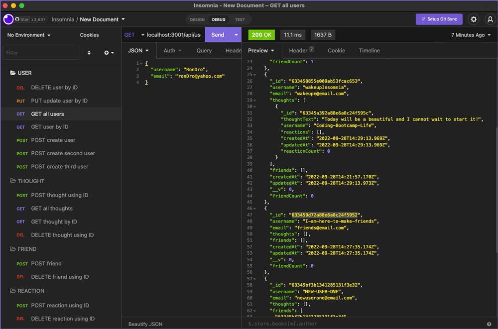

# social-path-network
## When choosing friends, always choose wisely!

## Purpose:

An NPM app used to create, update and delete USERS, THOUGHTS, FRIENDS and REACTIONS. This app can be tested in INSOMNIA!

## ScreenCastify Link:

## https://watch.screencastify.com/v/9kocaKzdOuwLuIyVMGc1

 

## **Table of contents:**

- [Installation](#installation)
- [Start](#start)
- [Usage](#usage)
- [Contribute](#contribute)
- [Questions](#questions)

 

     

 

 

## This Full-stack App Was Created Using:

- JavaScript
- NodeJS
- MongoDB / Mongoose
- Express
- Insomnia
- GitHub

 

## Installation:

### To install all packages use this command in the the terminal:

`npm i`

 

## Start:

### To start use this command in the the terminal: 

`npm start`

 

## Usage:

### The respository can be cloned and placed in a folder remotely.

 

## Contribute:

### Please contact me regarding contributing to this repository. All additions must be approved.

 

## Questions?

### If you have any questions here's how to contact me:

- Username: DronetDevDesign
- Repository: https://github.com/DronetDevDesign
- Email: ron@DronetDevDesign.com

